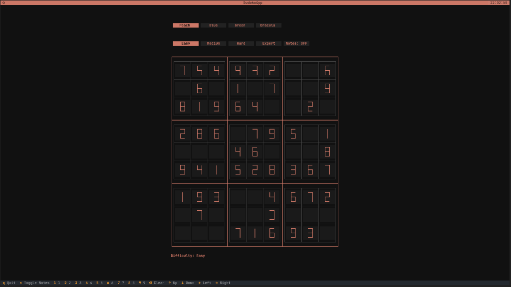

# 🧩 Terminal Sudoku App

A beautifully crafted, fully playable Sudoku game built entirely for the terminal using Python, Textual, and Rich.

---

### 📸 Screenshots

| SudokuApp (Peach Theme)
|:---:|:---:|
| 

---

## ✨ Features

- **Gorgeous UI**: A mathematically precise 7-segment digital display for digits and a spreadsheet-like contiguous grid layout.
- **Multiple Themes**: Play in Peach, Blue, Green, or Dracula dark modes.
- **Four Difficulties**: Easy, Medium, Hard, and Expert randomly generated puzzles.
- **Notes Mode**: Jot down potential candidates in cells just like on paper.
- **Auto-validation**: Highlights invalid placements instantly.
- **Keyboard & Mouse Control**: Navigate via arrow keys and type numbers directly, or use your mouse to select cells and buttons.

## 🚀 Installation

1. **Clone the repository:**
   ```bash
   git clone https://github.com/Lohitakshexe/sudokuApp.git
   cd sudokuApp
   ```

2. **Set up a virtual environment (Recommended):**
   ```bash
   python3 -m venv venv
   source venv/bin/activate
   ```

3. **Install the required dependencies:**
   ```bash
   pip install -r requirements.txt
   ```

## 🎮 How to Play

Run the game using Python:
```bash
python3 main.py
```

- **Select Cells**: Click with your mouse or use the `Arrow Keys`.
- **Input Numbers**: Type digits `1-9` to place them.
- **Delete Numbers**: Press `Backspace` or `Delete`, or type `0`.
- **Toggle Notes**: Click the `Notes` button or press `n` to toggle Notes mode.
- **Change Difficulty/Theme**: Click the respective buttons with your mouse.
- **Quit**: Press `q`.

Enjoy your terminal puzzle solving!
